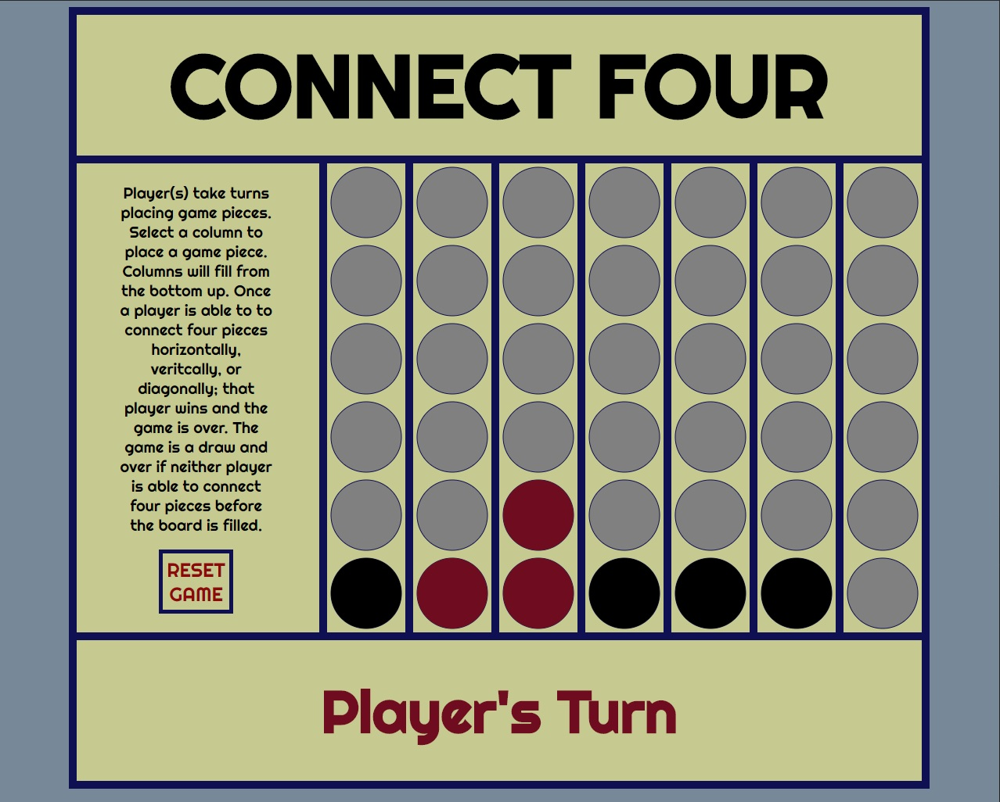

# Connect Four

## Installation

Connect Four can be played online or locally. To play online, go to the following link:

[Connect Four](https://tuhoalyhuynh.github.io/)

Instructions for installing locally:

1. Go to the following github repository: [my-connect-four-game](https://github.com/tuhoalyhuynh/my-connect-four-game)
2. `fork` the repository
3. Copy the url for your forked copy.
4. `clone` to your local machine using the following command without the parentheses: `git clone (your url)`
5. Once cloned to local machine, open `index.html` to play game.

## Game Instructions

On Start Screen, select Game Mode to start. Players can choose from the following three options:

1. 1PB - One Player Mode as Black game piece vs Computer
2. 1PR - One Player Mode as Red game pieve vs Computer
3. 2P - Two Player Mode. Players take turns placing game piece.

Once the game is started, player(s) take turns selecting a column to place their respective game piece. Columns will fill from the bottom up as player(s) place game pieces into columns. To win player(s) must connect four game pieces of the same color horizontally, vertically, or diagonally. Once win coditions are met, a winner is declared. If neither player is able to connect four game pieces of the same color before the game board is filled, the game is a draw. Player(s) may end and restart that game at anytime by selecting the 'Reset Game' Button on the left hand side.

Once a game is completed and winner or draw is declared, the start screen will reappear allowing player(s) to start a new game.

## Changelogs

### v1.04

Cleaned up code to minimize repetitiveness

### v1.03

Add additional styling to UI.

### v1.02

Add Single Player Mode. Player plays against "AI". The computer randomly chooses a column to place game piece. Additional coding for Game Message to display "Player/Computer" in Single and "Player One/Player Two" in Two Player mode.

### v1.01

Add Start Screen. Game unplayable until game started. Screen disappears once game is started. On reset, start screen reappears and game is unplayable until started.

### v1.00

Add Reset Button to reset game. Added functionality to not allow players to place game pieces once win/draw condtions are met. Game fully playable.

### v0.04

Add Game Message Disply to display player turns, draw, and winner. Add win conditions for game. Reorganized file structure, moved win conditions to separate file to de-clutter main.js.

### v0.03

Add 'event listeners' to canvas for placing game pieces. Add logic to determine x- and y-positions for game piece placement. Add logic to identify where each piece is placed. Add draw condition.

### v0.02

Add some core game functionality JS. Built out initial game state using Canvas.

### v0.01

Add base HTML for game and some basic CSS styling for game UI. HTML will incorporate Canvas. Basic CSS styling includes building out UI in grid format.

### v0.00

Connect Four will be a two player turn-based game. Each player will take turns selecting a column. When a column is selected, it will fill from the bottom of the column up. Depending on the player, it will fill with red or black. Once a player has four matching color pieces (horizontally, verivally, or diagonally), win conditions are met.

The above image shows what the general layout of the game will look like. The game will UI will be built out in CSS with a grid layout and HTML canvas crawler. Canvas crawler will be used to render game pieces.