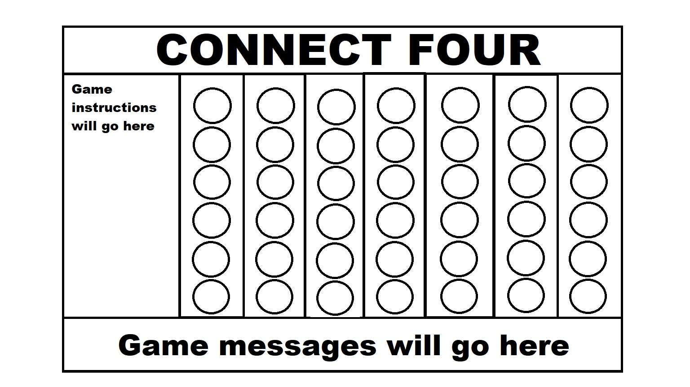
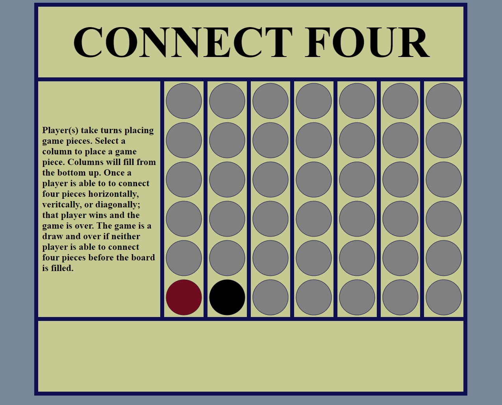

# Connect Four

## Installation

## Game Instructions

## Changelogs

### v0.00

Connect Four will be a two player turn-based game. Each player will take turns selecting a column. When a column is selected, it will fill from the bottom of the column up. Depending on the player, it will fill with red or black. Once a player has four matching color pieces (horizontally, verivally, or diagonally), win conditions are met.

The above image shows what the general layout of the game will look like. The game will UI will be built out in CSS with a grid layout and HTML canvas crawler. Canvas crawler will be used to render game pieces.

### v0.01

Add base HTML for game and some basic CSS styling for game UI. HTML will incorporate Canvas. Basic CSS styling includes building out UI in grid format.

### v0.02

Add some core game functionality JS. Built out initial game state using Canvas.

